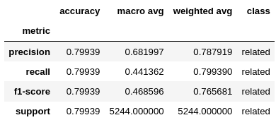
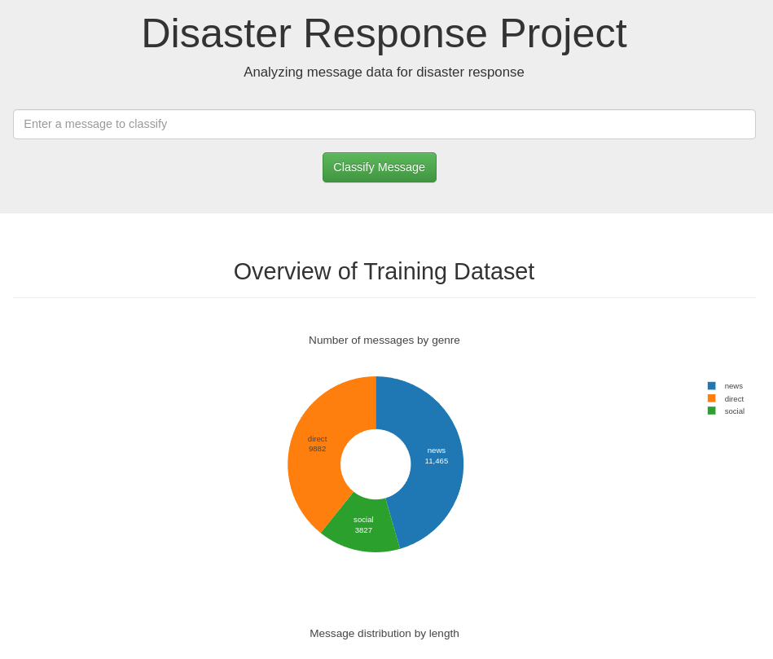
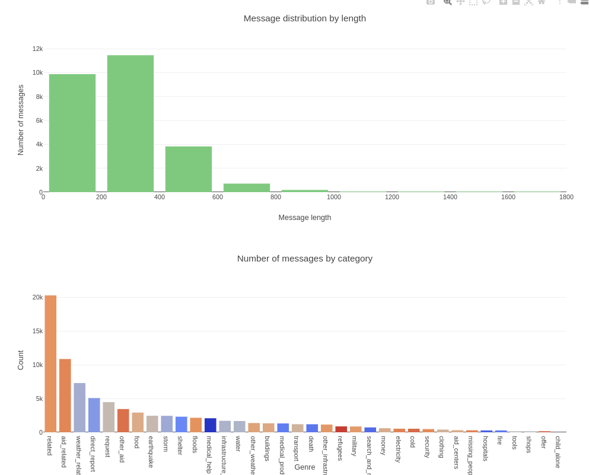
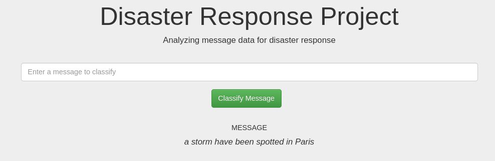
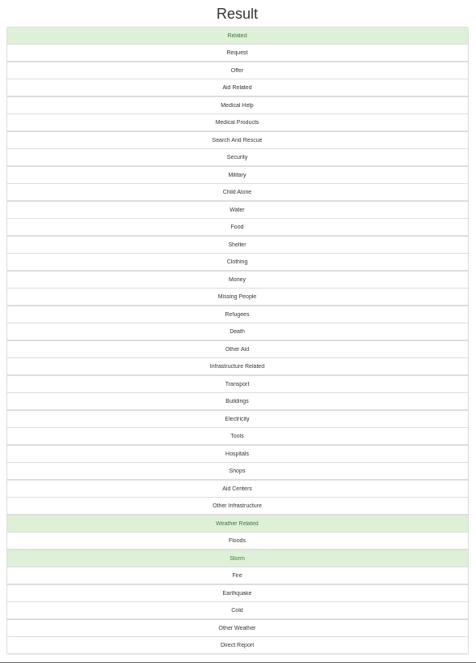

# Disaster-response-analysis
<p align="center">


</p>


Text data one of the most used kinds of data all over the internet, people exchange billions of text data with every new day.

During a global crisis, social media plays a crucial role in transmitting the data between people. Some of these messages are very useful for goverments and entities responsible for decision making.

To summarize, the **classification** of this textual data is so beneficial in order to make the transmission of information easier, faster and more efficient.
 

# Table of Contents

1. [Overview](#overview)
2. [Installation:](#installation)
3. [File Description](#file-desc)
4. [Dataset](#data)
5. [Modeling Process](#model)
6. [Model evaluation](#result)
7. [Screenshots](#screenshots)
8. [Effect of Imbalance](#effect)

### Overview: <a name="overview"></a>

In this project, I worked on analyzing text data exchanged during a disaster, worked on building a model to **classify** the messages into **36** categories to make it easier to transmit information to the right entity.
and finally implemented a **Web application** that showcases some **visualizations** about the data and the **multi-label-classification** task.

### Installation:  <a name="installation"></a>

1. First you need to clone the repository to your local machine using this command:

    ```
    git clone git@github.com:aminebennaji19/Disaster-sentiment-analysis.git
    ```

2. After cloning the repository, you need to install the install the project requirements.

- **PS**: This project was developed using **Python3.7**
    
    ```
    pip3 install -r requirements.txt
    ```

### File Description <a name="file-desc"></a>

* [**app**](app/): Flask Web App
    * [**templates**](app/templates): Folder including HTML templates.

    * [**run.py**](app/run.py): Flask Web App main script.

* [**data**](data/): Folder containing the data files, the ETL pipeline       and            preprocessing steps.

    * [**disaster_response.db**](data/disaster_response.db): The stored database after  ETL.
    * [**categories.csv**](data/categories.csv): The dataset including message categories.
    * [**messages.csv**](data/messages.csv): The dataset including text messages.
    * [**process_data.py**](data/process_data.py): The ETL pipeline script.

* [**models**](models/): Folder containing the training and evaluation pipeline.

    * [**classifier.pkl**](models/classifier.pkl): The trained model pickle file.
    * [**train_classifier.py**](models/train_classifier.py): The modeling pipeline script.

* [**notebooks**](notebooks/): Notebooks folder.

    * [**ETL Pipeline Preparation.ipynb**](notebooks/ETL%20Pipeline%20Preparation.ipynb): 
        Notebook contains ETL Pipeline.
    * [**ML Pipeline Preparation.ipynb**](notebooks/ML%20Pipeline%20Preparation.ipynb): 
    Notebook contains ML Pipeline.

* [**img**](img/): Folder including screenshots and necessary images.

* [**requirements.txt**](/requirements.txt): The project requirements file.


### Dataset <a name="data"></a>
The disaster data was taken from [Appen](https://appen.com/). It has two main files messages.csv and categories.csv
containing the exchanged messages and their annotations.

#### Data Cleaning

The process of data cleaning is based on 

1. Merge the **messages** and **categories** dataframes based on **id**.
2. Split the categories into separate columns.
3. Convert the categories values to binary [0,1].
4. Drop the **categories** column and use the separate category columns instead.
5. Drop the duplicates from the **messages** column.
6. Export the final clean dataframe into and save it as a table in a **SQL** database.

- To run ETL pipeline that extracts, cleans and saves data in a SQL database use this command:
    
    ```
    python3 data/process_data.py data/messages.csv data/categories.csv data/disaster_response.db    
    ```
where the system arguments correspond to:

- **messages_path**: Path of the CSV file containing the text messages.
- **categories_path**: Path of the CSV file containing the message categories.
- **database_filepath**: Path of the output database to save.  

After the ETL pipeline is finished successfully, you'll find a file named **disaster_response.db** in the specified path while running the pipeline.


### Modeling Process <a name="model"></a>

1. Load the **messages** table from the **SQL** database and select **categories**, **training features** and the **target columns**.
2. Clean and tokenize text messages after removing ponctuations, capital letters, stop words and perform the lemmatization of text messages to get the root of the words.
3. Build a machine learning pipeline using **TfidfVectorizer** and **XGBClassifier** and add the feature for fine-tuning the parameters using **GridSearchCV** algorithm.
4. Split the data into training and test sets.
5. Training, evaluating and saving the classifier.
6. Then using hyperparameter tuning with 5 fold cross-validation fitted 40 models to find the best **XGBoost** model for predicting disaster response category. These are the best parameters:

<code>
{'multioutput_classifier__estimator__learning_rate': [0.1], 'multioutput_classifier__estimator__max_depth': [5], 'multioutput_classifier__estimator__n_estimators': [200]}
</code>

<br>

- To run the Machine Learning pipeline that prepares, trains, evaluates and saves the classifier into a pickle file run:

    ```
    python3 models/train_classifier.py data/disaster_response.db models/classifier.pkl True
    ```
Where:

-**database_path**: Path of the SQL database containing the transmitted messages.
-**model_filepath**: Path of the output model to save.
-**fine_tune**: A boolean parameter controlling the model fine-tuning.

**PS**: You can set **fine_tune** argument to **False** to use best parameters and avoid fine-tuning again.

A file called **classifier.pkl** will be saved to the specified path while running the ML pipeline.


### Model evaluation <a name="result"></a>

We evaluated our model trained with 5-folds cross validation splits using [**classification report**](https://scikit-learn.org/stable/modules/generated/sklearn.metrics.classification_report.html) for each **category**.

This figure illustrates the evaluation results for the column named **related**.
<p align="center">


</p>


### Screenshots <a name="screenshots"></a>

- Later, you can use this command to run the web app showcasing our classifier and visualizations about the data.
       
    ```
    python3 app/run.py
    ```

- Go to http://0.0.0.0:3001/ from your local browser to access to the app.
 

These are some figures illustrating the home page of our web application alongside with 
a result of multi-label classification.
<p align="center">


</p>
<br>
<p align="center">


</p>

<br>
<p align="center">

</p>
<br>
<p align="center">

</p>


### Effect of Imbalance: <a name="effect"></a>
The dataset is so imbalanced across all the categories which affects the behaviour of our classifier and causes some missing predictions.

The model will not generalize well for imbalanced classes with fewer samples. We can work on reducing the effect by using some  [**techniques**](https://towardsdatascience.com/5-techniques-to-work-with-imbalanced-data-in-machine-learning-80836d45d30c) that deal with datasets imbalance.

For some categories, we should focus on **recall** as all the categories has the same precision.
